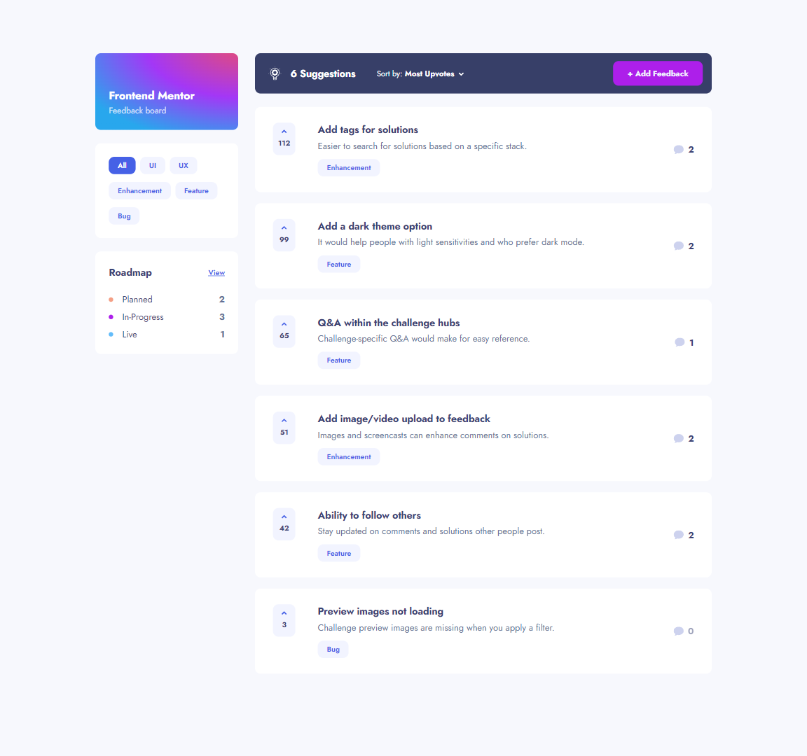
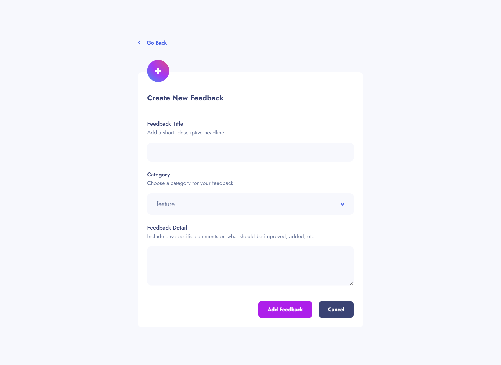

# Frontend Mentor - Product feedback app solution

This is a solution to the [Product feedback app challenge on Frontend Mentor](https://www.frontendmentor.io/challenges/product-feedback-app-wbvUYqjR6). Frontend Mentor challenges help you improve your coding skills by building realistic projects.

## Table of contents

-  [Overview](#overview)
   -  [The challenge](#the-challenge)
   -  [Expected behaviour](#expected-behaviour)
   -  [Screenshot](#screenshot)
   -  [Links](#links)
-  [My process](#my-process)
   -  [Built with](#built-with)
-  [Author](#author)

## Overview

### The challenge

Users should be able to:

-  [x] View the optimal layout for the app depending on their device's screen size
-  [x] See hover states for all interactive elements on the page
-  [x] Create, read, update, and delete product feedback requests
-  [x] Receive form validations when trying to create/edit feedback requests
-  [x] Sort suggestions by most/least upvotes and most/least comments
-  [x] Filter suggestions by category
-  [x] Add comments and replies to a product feedback request
-  [x] Upvote product feedback requests
-  [x] Keep track of any changes, even after refreshing the browser (`localStorage` could be used for this if you're not building out a full-stack app)

### Expected Behaviour

-  [x] Suggestions page

   -  [x] Only product feedback requests with a status of `suggestion` should be shown on the Suggestions page.

-  [x] Roadmap

   -  [x] Feedback requests with a status of `planned`, `in-progress`, or `live` should show up on the roadmap, and should be placed in the correct column based on their status.
   -  [x] Columns should be ordered by upvote totals.

-  [x] Creating a product request

   -  [x] When creating a new piece of feedback, an ID needs to be assigned which increments the current highest product request ID by 1.
   -  [x] The default status for a new piece of feedback is `suggestion`. This places it on the Suggestions page.

-  [x] Editing feedback

   -  [x] If a piece of feedback has its status updated to `planned`/`in-progress`/`live` it moves through to the roadmap and should show up in the correct column based on its new status.

-  [x] Add comments/replies
   -  [x] Use the data from the `currentUser` object in the `data.json` file to populate the user data for any new comments or replies.
   -  [x] Any comment/reply can have a maximum of 250 characters.

### Screenshot

-  [All Screenshots](./screenshots/)

### Links

-  Live Site URL: (https://devubong-product-feedback.netlify.app/)

## My process

### Built with

-  Semantic HTML5 markup
-  styled-components
-  Mobile first design
-  React
-  Redux/Redux Toolkit
-  React Router
-  React Helmet
-  Formik
-  Accessibility in mind

## Author

-  Website - [Ubong Sylvester](https://www.devubong.com)
